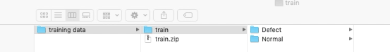

- [Machine learning on SAP Edge Services Platform](#machine-learning-on-sap-edge-services-platform)
  - [Overview](#overview)
  - [Product Documentation](#product-documentation)
  - [Use case](#use-case)
  - [Training a model: the working](#training-a-model-the-working)
  - [System topology](#system-topology)
  - [Pre-requisites](#pre-requisites)
  - [SAP Data Intelligence](#sap-data-intelligence)
    - [Deploying custom Machine learning docker image](#deploying-custom-machine-learning-docker-image)
    - [Deploying Machine learning training pipeline](#deploying-machine-learning-training-pipeline)
    - [Training a machine learning model](#training-a-machine-learning-model)
  - [SAP Edge Services](#sap-edge-services)
    - [Overview](#overview-1)
    - [Requirements](#requirements)
    - [OSGi Bundle Instructions](#osgi-bundle-instructions)
    - [Building the Project](#building-the-project)
    - [Installation](#installation)
    - [After Deployment](#after-deployment)
      - [Directory Structure](#directory-structure)
      - [Edge ML Daemon (Python Script)](#edge-ml-daemon-python-script)
  - [Limitations and possible improvements to the sample](#limitations-and-possible-improvements-to-the-sample)
  - [Possible next version of the sample](#possible-next-version-of-the-sample)
  - [A few words on effective training of the model](#a-few-words-on-effective-training-of-the-model)
  - [How to obtain support](#how-to-obtain-support)
  - [Copyright and License](#copyright-and-license)

# Machine learning on SAP Edge Services Platform

## Overview
This sample demonstrates one of the ways a quality machine learning solution can be deployed on SAP Edge Services platform, which typically sits in sites without reliable connectivity to internet. This brings a set of challenges. For example
* Executing machine learning inferencing in real time when suitable end-point in the cloud is not reachable
* Leveraging powerful machine learning capabilities in a remote location with full training-deployment life cycle support 
* It would be expensive to stream of all of the sound data into cloud even if connectivity was available.

A machine learning training is often a data intensive operation requiring scalable capabilities and access to data e.g from SAP systems, telemetry and external data. These tasks are admittedly difficult to manage economically in remote sites. Furthermore system must keep running over extended periods of time in an economical manner.

We still want to have best of the both worlds i.e. real time infererencing in remote sites and a cloud trained machine learning model built using best of breed technologies at scale. This sample should be seen in that context.

## Product Documentation

Product Documentation for SAP Edge Services is available as follows:

[SAP Edge Services, cloud edition](https://help.sap.com/viewer/p/EDGE_SERVICES)

[SAP Edge Services, on-premise edition](https://help.sap.com/viewer/p/SAP_EDGE_SERVICES_OP)

## Use case
The sample covers a usecase to detect defective welding jobs at a customer in real time. 

Studies have shown that welding sounds can indicate defects in welding. Therefore sound samples will be used to train a machine learning model leading to an un-intrusive detection system.
Also as part of post processing, a service ticket will be created for the technicians in response to defective welding events.


From an algorithmmic point of view, the problem statement in brief is, given a sample of sound in computer readable format such as .wav file determine if it represents a defective welding or not.


## Training a model: the working
It is assumed audio samples of welding are available: normal and defective, organized in labelled folder like so:


It turns out the faulty and welding sounds differ in the way they sound: the defective welding sound is unstable with numerous spikes. 

First a few words on digitized sound. The sound files in .wav formats are digitized by sampling at a certain rate, say 44 k Hz. Each of these sound sample represents a series of amplitudes of the sound wave at a point in time and range of levels of sound captured depends on the number of bits used. For example 16 bit sound sample can capture 65536 levels of detail at each instant.

Now that is an amplitude perspective, which is not particularly helpful for locating inherant patterns. A better way to represent sound for that purpose  would be by articulating frequencies contained in sound in time.  Spectrograms are such representations and MFCC spectrgrams in particular make patterns more distinct by applying a suitable vertical scaling. You can see that in the picture below. 
Therefore MFCC spectograms will be used in the sample for training machine a learning model.


Essentially our traning pipeline will 
* Read sound files from the training archive
* Break them into one second splits
* Extract MFCC spectogram for each split
* Train Convolutional Neural Network(CNN) model of Tensorflow framework
* Export the trained model
  
Choice of Convolution Neural Network is based on the fact that they are good at detecting pattern in spatial data(e.g. two dimensional data: time vs frequency vectors)  

The sample has been tested against real welding data for accuracy. Nonetheless, after customizing this sample to your own implementation, make sure to thoroughly test before deploying to production environments.


The sample consists of two parts
* Training artifacts for SAP Data Intelligence in Cloud
* Custom machine learning service for SAP Edge Services, which uses a pre-trained machine learning model in Edge sites to detect defective welding.


## System topology
Sample relies on pipelining capabilities SAP Data Intelligence, which also 
* allows possiblity to provide custom runtime for machine learning as Docker images
*  connectivity to various systems: hyper-scalar and SAP etc. 

After a model is trained by SAP Data Intelligence, freshly trained model is automatically downloaded by SAP Edge services

For the purpose of this demo we will use Amazon S3 buckets as staging area for training data and machine learning models for exchange between SAP Data Intelligence and SAP Edge services.

The trained machine learning model is downloaded automatically and periodicially by SAP Edge services.

So let's dive into the details of artifacts and code needed to deploy the samples in your SAP Data Intelligence and SAP Edge Services environment.

The sections below describe how to build, deploy and run this sample.

## Pre-requisites
An Amazon S3 bucket and a user with read/write credentials (note the S3 access key/secret, you will need those) where you have a bucket by name 'edgepoc' with two folders 'data' and 'train' for storing training data and trained model respectively.


## SAP Data Intelligence
There are primarily two artifacts to be deployed
* Custom machine learning docker image containing audio and ML packages in which our model will be trained
* The machine learning pipeline 

In order to deploy above pipeline artifacts, open the SAP Data Intelligence Pipeline modeler.


### Deploying custom Machine learning docker image
This is a docker image with 
* Python 3 
* Keras/Tensorflow 
* Audio processing libraries / librosa

Although you will need above components, this is only an example image, you can buid your own. The important is
using correct set of Tags when creating docker image in SAP Data Intelligence to be recognized by vFlow operators. Here are the steps you will
* Choose the 'Repository' tab on the SAP Data Intelligence pipeline and open 'dockerfiles' folder
* Click down arrow next to the '+' button on the top right of panel as shown below and choose 'Create Docker File'
  


* Copy and paste content content of [this](src/di/vflow/dockerfiles/edge2/Dockerfile) Docker file on the middle panel and configure the pipeline after opening the properties panel on the right:  add tags as shown below (use '+' button under tags), save and give it a name e.g. 'edge2'


* Choose right arrow button   to the left of the Save button in the toolbar located top right corner to build the docker image. This should take a few minutes, after which your Docker image is ready


### Deploying Machine learning training pipeline
This is a pipeline consisting 4 operators: Training data importer, Splitter, Trainer, Model Exporter. Here are the steps to deploy it

* Copy contents of [graph.json](src/di/vflow/graphs/welding_audio_trainer/graph.json) to clipboard
* Create a graph on the pipeline modeler by selecting the 'Graphs' panel on the left and choosing the '+' button on same panel. Now go to json tab in content panel and paste the clipboard contents
* Enter the S3 credentials in the Data Importer and Model Exporter source code: search/replace '<aws_key>'/'<aws_secret>' with your AWS acess key and secret respectively. You can do this directly in the json
* Switch back to the 'Diagram' perspective (see tab label near top/right corner of content panel)
* Click pipeline properties icon to open the properties panel, click blue area of the pipeline in the modeler, select and choose the name of custom ML docker image that you want to use for this pipeline: e.g 'edgeml2' you just created
  


* Hit save and give it a name

Your pipeline is now ready

### Training a machine learning model
* Compress the training folder, give it a name (eg. train.zip) and upload it to 'data' folder of the S3 bucket you just created
  
* Open the pipeline modeler and in the DataImport operator property 'dataset', enter the name of the compressed archive you just uploaded. eg. data/train.zip. Also enter the name of the model to be exported in the ModelExport operator as 'audio_detectx' ('model' property)
* Start the pipeline and monitor the various terminals to observe activities in the running operators as they occur

The training pipeline will automatically upload the the trained model to the S3 bucket you setup after the training is finished
  
## SAP Edge Services

### Overview

The current implementation of this sample is built as a \*.JAR file that can be run at the edge inside of an OSGi runtime, such as the SAP SAP IoT Edge Platform. This bundle can be managed and deployed to a running instance of SAP IoT Edge Platform on the edge machine by SAP Edge Services' Policy Service.

### Requirements
Doc: https://help.sap.com/viewer/a1c5f93025864b6f9a867a12caf6dd06/1911/en-US/13c486e5502f46d8a482aeeb450ea932.html
Prerequisites:
- [JDK](https://www.oracle.com/technetwork/java/jdk8-downloads-2133151.html) 8 64-bit
- [Python 3.*](https://www.python.org/downloads/)
  - <**! TODO:** *Insert list of required Python packages*>
- [Maven 3.6](https://maven.apache.org/download.cgi)
- [Git](https://git-scm.com/downloads)

### OSGi Bundle Instructions

The current implementation of the Edge Machine Learning proof of concept (PoC) is built as a \*.JAR file that can be run at the edge inside of an OSGi runtime. This bundle can be managed and deployed by SAP Edge Services' Policy Service.

### Building the Project

1. Clone the project.
2. Install python modules and sound processing packages needed for inferencing 
``` shell
  pip install boto3
  pip install librosa
  pip install matplotlib
  pip install tensorflow==2.0.0a0
  pip install tensorflow==1.9 numpy==1.16.4
  pip install keras==2.2.0
  pip install pydub
  pip install libmagic
  apt-get update && apt-get install -y  libsndfile1
  apt-get update && apt-get install -y ffmpeg python3-magic
  git clone https://github.com/tyiannak/pyAudioAnalysis.git
  pip install -e pyAudioAnalysis/
```

3. Tweak inferencing script located here located at [src/edge/src/main/resources/bin/](src/edge/src/main/resources/bin/edge_ml_daemon.py) as necessary

   * Please replace '<aws_key>'/'<aws_secret>' with your AWS acess key and secret respectively 
   * Review function "send_data_to_gateway" and adjust the endpoints and other constants as necessary => 
`   
   device_id = "MLDevice01"
   sensor_id = "ML_Test_Sensor"
   sensor_type_alternate_id = "67"
   capability_alternate_id = "inf01"`


4. Navigate to the [`/src/edge/`](src/edge) directory. Build using Maven from the command line:
   ```
   $ mvn clean package
   ```
   
5. You should see a message like this and you should see an `EdgeML-1.0.0.jar` file in the target subdirectory:
   ```
    [INFO] ------------------------------------------------------------------------
    [INFO] BUILD SUCCESS
    [INFO] ------------------------------------------------------------------------
    [INFO] Total time:  5.828 s
    [INFO] Finished at: 2019-10-10T16:19:05-04:00
    [INFO] ------------------------------------------------------------------------
   ```

### Installation
Prerequisites:
- Set up an SAP IoT Edge Platform on the target machine. For instructions, please refer to the following JAM page: https://jam4.sapjam.com/wiki/show/XaRvWNbDMggAVtAdhpQ1qp
- A built `EdgeML-<VERSION>.jar` file
- Edge Services Streaming Service is deployed to and running on the Edge Platform


1. Log into SAP Edge Services Policy Service.

2. Click on the **Settings** tile. In the **Settings** tile:
    - Set the  SAP IoT credentials to match the SAP IoT tenant that your edge platform is registered with (please refer to the above JAM link if you have no done so already!).
    - Ensure that the "*Allow upload of Custom Services (OSGi bundles) to my IoT Edge Platforms*" option is checked. 
    - Save your settings.

3. Return to the launchpad.

4. Click on the **Edge Services Management** tile. In the sandwich menu (left-hand side navigation), click on **Services**. In the **Services** menu, click on the '+' button to upload a new Custom Service.

5. Enter the following:
   
   | Field               |  Value                                 | 
   |---------------------|----------------------------------------| 
   | Name                |  EdgeML                                | 
   | Configuration Topic |  MLPOC                                 | 
   | File Name           |  *(Upload your EdgeML-1.0.0.jar file)* | 
   | Service Type        |  Custom                                | 
   
   Click **OK**.

6. In the sandwich menu (left-hand side navigation), click on **Groups and Gateways**. Find your edge platform in the list. Select it. Click on the **Services** tab of gateway. Click '+' to deploy a service to your gateway. Select the **EdgeML** service. This will deploy the OSGi bundle to your gateway.

### After Deployment

This section describes the behavior of the EdgeML service at the edge after deployment.

#### Directory Structure

The EdgeML custom service will set up its own directory structure under the `../edgeservices/` directory, at the installation location of the SAP IoT Edge Platform.

```
+ edgeservices/
    + ml-poc/
       + bin/
       + image/
       + input/
           + processed/
       + logs/
       + output/
       + model/
       + split/
           + processed/
```

* The `bin/` directory contains the Python script for the Edge ML Daemon..
* The `input/` directory is the location in which the input sound files should be placed in order to be picked up by the Edge ML Daemon, once it is running (see next section).
* The `split/` directory will contain the sound files after pre-processing, on which the Edge ML Daemon will perform inference.
* The `output/` directory will contain the output of the inference. The inference results will also be output to the Edge Platform console.
* The `model/` directory contains the latest model downloaded from the S3 bucket.

#### Edge ML Daemon (Python Script)

The Edge ML Daemon Python script handles the necessary pre-processing steps for the current version of the sample. It can be found and modified in this repository here: [/src/edge/src/main/resources/bin/](src/edge/src/main/resources/bin/). 

This script is packaged with the EdgeML bundle and performs the necessary pre-processing steps of the sound files, polling the `input/` directory for input. It also updates the model at a set interval, performs the splitting of sound files into one-second clips, and outputs the inferences to standard output and the `output/` directory.


The Edge ML Daemon's life-cycle is managed by the EdgeML OSGi bundle. The daemon is started by inputting the following command to the gateway:
```
  g! startEdgeDaemon
```

The Edge ML Daemon can be stopped (when running) with the following command to the gateway:
```
  g! stopEdgeDaemon
```

## Limitations and possible improvements to the sample
There are some limitations in the sample
* A number of internal variables in the pipeline and the inferencing scripts could be turned into configurations for productive use. In particular credentials must be secured.
* Inferencing script can improved to dyamically map welding sounds to specific welding machine and  assets (serial number, model etc)
* Others
  
## Possible next version of the sample
* Demonstrate scalability aspects of SAP Data Intelligence to handle large training workloads, also introduce parallel processing for inferencing
* Provide addtional configuration and tuning possibilites in the training pipeline and operators. eg. credentials, audio split window size
* Ability to expoert inferencing script from SAP Data Intelligence
* Although sample scripts include InceptionV3 model inferencing, that topic requires a detailed treatment another time


## A few words on effective training of the  model
The model was tested to perform well with tested data samples. 
Although in principle any welding mal-function can be detected by exhaustive training with large amount of samples, a few simple tricks can improve the effectiveness of the system in a practical manner without expensive undertaking
* Make sure all known defective conditions are covered in the training. 
* Pay particular assumption to any mis-predictions in an ongoing basis and retrain the model based on those samples with corrected labels. This should lead to continuous improvement of the accuracy over time.
* A "moving window" inferencing approach could be used to improve the accuracy of the model and elmiminate "noise" in predictions: for example make a final infernence based on an aggregate of individual inferences for last N audio segements

With SAP Data Intelligence it is possible automate a lot of such activities, but that is a topic for another time.

